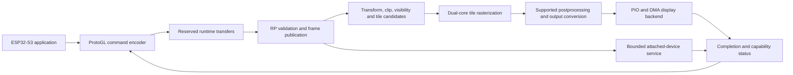

# ProtoGPU / TinyGPU: Architecture and Implementation Handoff Plan

Version 2.2 · 7 October 2026 · Implemented protocol-9 software architecture; physical qualification remains open

## 1. Decision, scope, and document authority

Build this repository into a low-cost RP2350 graphics-coprocessor firmware. The initial host is ESP32-S3. The host runs the application, animation, networking, asset storage, and updates; the RP2350 performs the heavy 3D transformation, visibility, rasterization, shading, and display-output work. A full-frame pixel-upload path is useful for diagnostics, but is not proof of 3D offload.

[ProtoGL](https://github.com/BaiTian6641/ProtoGL) is the host-facing graphics library and shared protocol owner, cloned into this repository at `ProtoGL/` as a Git submodule of `git@github.com:BaiTian6641/ProtoGL.git`. This repository owns the RP2350 implementation, not a competing TinyGPU graphics API. Both codebases can now be edited together while preserving separate upstream history and an explicit compatible API revision.

Use dual Cortex-M33 cores and a bounded bare-metal scheduler built from the existing tile scheduler. Do not add RP-side FreeRTOS or develop a general-purpose replacement RTOS. ESP-IDF's existing host-side FreeRTOS is independent of this decision.

The minimum graphics configuration uses internal SRAM only. No MRAM, nonvolatile external VRAM, or “nvPSRAM” purchase is required. PSRAM is volatile optional capacity for future textures and cold assets, not a prerequisite for rendering or persistence. Static firmware boot may use inexpensive ordinary NOR flash; firmware storage and external graphics RAM are different concerns.

Support two firmware-storage/boot profiles and independently selected display/device profiles. Provide real PIO/DMA backends for SPI displays, HUB75, addressable LEDs, and a documented custom-array interface. These outputs do not all have to run simultaneously on the minimum board. Concurrency is allowed only for explicitly budgeted combinations.

### 1.1 Authority and tracking

- This document is the canonical architecture. It replaces the speculative version 1.0 at this same path.
- [Implementation Tracker](Implementation_Tracker.md) owns task IDs, dependencies, progress, agent write boundaries, acceptance gates, and evidence records. Do not maintain a second task list in this document.
- [README](../README.md) describes the current checkout and entry commands; it must not advertise planned backends as working.
- ProtoGL shared headers are the protocol authority. Documentation labels, old comments, and this plan do not override serialized fields.
- Version 2.0 reconciles actual source, restores the 3D-first objective, adds both boot profiles, makes PSRAM optional, replaces guessed memory headroom with allocation accounting, and adds bounded device/clock/display contracts.
- Version 2.1 integrates the local ProtoGL submodule into firmware/native build paths and records its Arduino-oriented host boundary; it does not port the host application or qualify new GPU features.
- Version 2.2 records the completed source/native/Arm cutover, explicit SRAM lifetime reuse and reference profiles; hardware/current/stack/offload gates are not inferred from builds.

### 1.2 Current cutover and deferred application scope

Firmware/API work is now protocol9. Shared codecs live in `ProtoGL/src/PglRuntimeProtocol.h` and `PglRenderCommands.h`; API/frame admission, real PIO SPI target/readback, ROM-UART loader, both SDK boot binary types, four concrete outputs, bounded scheduler, allowlisted devices, deferred clock profiles, optional QMI assets and release packaging are implemented. Source/API/firmware evidence is tracked separately from physical gates.

The latest application target is [`BaiTian6641/ProtoTracer-ESP32S3-Port`](https://github.com/BaiTian6641/ProtoTracer-ESP32S3-Port), SSH URL `git@github.com:BaiTian6641/ProtoTracer-ESP32S3-Port.git`. The user explicitly deferred its adaptation; it is not cloned or modified. P00-06 and P12-01..05 remain recorded for that later job, not prerequisites to source/API solidity.

Implemented resource limits: 8192 logical pixels,64 tile cells,1024 transformed vertices,1280 source/projected triangles,64 meshes/materials,16 textures,4 cameras,64 draws,8 layers,4 verified PSB programs,128 queued2D commands,64KiB scene arena,2×16KiB ingress and32KiB static SRAM reserve floor. Aggregate allocation/staging can fail; maxima are not independently fillable.

The full-frame three-stock-program postprocess scene costs1,335,296 weighted operations. The initial1Mi proposal was raised to finite2Mi rather than narrowing the image. Source1280 preserves the original1166-triangle teapot. Camera projection remains declared panel-space, with actual target stride/scissor/extents.

Effects dispatch real disjoint bands through the active bounded scheduler. Verified instructions/constants stay resident; a pass-local uniform bank binds resolution/time, and paired-dispatch errors propagate as FrameFailed. Firmware admission rejects reserved generation255, including raw callers. `QueryMemory` reports actual allocator payload/capacity/peak/largest-free values; `QueryMetrics` counts cumulative source preparation across cameras without double-counting prefix totals.

SRAM ownership is explicit: the compact transactional parser and view preparation share13KiB target phase storage; a typed16KiB union alternates world vertices and depth using C++17 placement lifetimes. Workers/output source readers drain before reuse. Float80-byte triangles and4-byte conservative tile rectangles preserve lossless stable coverage. Full redraw removes the unsafe frame-signature path.

Runtime command/control are single-lane, bulk one/four-lane; initialSCK1MHz and64µs CS gap. READY is mandatory before every host transaction, independent of credits. Control32/read64/bulk exact counts use captured prefixes; minimum31-byte physical body capacity keeps Cancel/Reset available for short resource batches. Status44 distinguishes Control from BulkTerminal,45 reservedzero. Queries expose real boot/capacity/fence/device/metrics/clock state, not synthetic free-memory or DMA-complete-as-displayed timestamps.

Host descriptors/source pointers stay owned through IDF reap; failed abort blocks reuse/freeing until actual drain. Recovery reinstates a faulted drained transport before reset/HELLO. Runtime Reset is Busy while armed; clock maintenance quiesces transport first, rolls earlier gates back on Busy, blocks new reservations and retimes active clients. Exact clock profiles150/100/75/125/240/288/250/300/336MHz use bounded VSEL1.1V≤150/1.2V>150. 300MHz is the user's board observation and336MHz is the requested48×7 profile, not vendor qualification. The GPU varies only `clk_sys`; reference/timers12MHz and UART/SPI/USB/ADC/HSTX48MHz remain fixed. `QueryClockConfiguration` adds exact tuple, required/actual VSEL setpoints and extended profile mask. Runtime8s watchdog feeds only after a full service turn.

Reference outputs are SSD1331 PIO≤4MHz (Transferred, noTE), HUB75 conventional128/64×64 1:32 with packed repeating scans and blank boundary IRQ work, WS2812B-V5/W2/2/4 timing at6.4MHz plus≥300µs reset, and clocked8-bit RGB888 custom latch/OE. One primary output owns shared67,584-byte workspace. Board-attached services are raw temperature ADC, fixed-address I2C0(0x3D,GP20/21) and explicit-drive GP26, bounded/correlated.

Optional selected-CS8 QMI uses canonical uncachedCS1 backing and complete pinned SRAM spans consumed by real mesh/texture samplers. No mandatory PSRAM/MRAM/persistence service exists. HUB/CUSTOM reference routing conflicts withCS8 and rejects. Both optional boot-storage variants are separately budgeted; physical capacity/timing/absence qualification remains open.

`HOSTLESS_DEMO` uses the same command/parser/frame/output path; real host session takeover disables it. `NONE` is explicit render-only output, not a fake physical driver. Build/profile/source hashes include diagnostic selection. Legacy octal receiver/I2C slave/MRAM/tier/persistence/duplicate diagnostics were removed; user backups and the useful teapot corpus remain.

### 1.3 Requirements and non-goals

| Requirement | Architectural decision |
|---|---|
| Free ESP32-S3 from heavy 3D rasterization | Upload resident indexed meshes/materials; submit camera/object state; render and present on RP |
| Low incremental cost | RP2350A-first board planning, SRAM-only baseline, single-lane runtime link first; include regulator, clock, buffers, reset, and isolation in BOM |
| Optional future textures/assets | One optional PSRAM backend; no mandatory cache, probes, or extra RAM chip in minimum profile |
| Adjustable GPU power/performance | Host-selectable qualified clock profiles; explicit safe-point transition and independent output timing |
| Flexible PIO output | Reuse and evolve DisplayDriver/DisplayManager; per-backend encoding, completion, resource, and fault contracts |
| RP-attached devices | Board-allowlisted bounded peripheral services, not arbitrary register access or host-provided PIO code |
| Host-loaded and static firmware | RAM_HOST and FLASH_LOCAL builds sharing one runtime and one ProtoGL contract |
| Modern-style GPU behavior | Command batches, typed generation handles, immutable frame inputs, explicit resource lifetimes, capabilities, fences, and render targets |
| Acceleration when worthwhile | Existing dual-core tiles, M33 DSP/FPU, measured SIO-interpolator paths, DMA/PIO for movement/timing; no fictional hardware rasterizer |
| Precise resource management | Linker-backed SRAM accounting, bounded allocation, fixed job/event pools, centralized GPIO/PIO/DMA/IRQ claims |

Non-goals: desktop Vulkan/OpenGL conformance, unrestricted vertex/fragment/compute programs, mandatory PSRAM, mandatory overclock, OTP programming, a new application framework, arbitrary display protocols without a specified electrical contract, and a general-purpose peripheral/OS abstraction. Existing useful 2D/layer and postprocessing operations remain capability-gated; they do not replace the 3D milestone.

The earlier 40 FPS baseline, 60 FPS objective, 12 ms budget, 70–100 FPS prediction, and 300–320 MHz suggestions came from version 1.0's unverified application assumptions. No such performance has been established in this checkout. Use 150 MHz for correctness. Treat 60 new frames/s as an initial development objective only until a representative/worst-case 3D scene and output profile are frozen. Do not change resolution, materials, geometry, or quality to manufacture a speedup.

## 2. Repository-backed historical starting point

The inventory below records the pre-cutover inspection, not current source locations or supported runtime options. Version2.2 §1.2 and README describe the implemented checkout. User `.bak2` files are historical and preserved.

| Area | Current evidence | Consequence |
|---|---|---|
| Build/dependencies | `CMakeLists.txt` builds `protogl_gpu`, uses in-repo `ProtoGL/src` and sibling `../ProtoGC/src`, and emits Pico SDK outputs | ProtoGL is cloned/pinned; restore ProtoGC and the remaining pinned build dependencies before a full baseline build |
| Boot | `src/main.cpp` initializes the runtime and launches core 1; CMake has no explicit `no_flash` binary selection | Normal Pico flash boot is the existing build path; a ROM host loader and dual-profile packaging are new work |
| “Headless” naming | `RP2350GPU_HEADLESS_SELFTEST` selects built-in 3D scenes and an SSD1331 OLED; `main.cpp` requests 360 MHz in that build | This is a hostless diagnostic, not RAM_HOST and not displayless operation; separate the terminology and remove mandatory experimental clocks during implementation |
| Graphics | `src/render/`, `src/math/`, `src/scene_state.h`, and `src/command_parser.cpp` already contain 3D, materials/textures, layers, and shader-VM machinery | Extend the renderer and correct its boundaries; do not replace it with version 1.0's sprite-only port |
| Scheduler | `src/scheduler/pgl_tile_scheduler.*` uses 16×16 tiles, an atomic claim counter, and multicore FIFO dispatch | Reuse tile ownership and evolve surrounding event scheduling; do not introduce a second job system |
| Host data plane | `src/transport/octal_spi_rx.*` implements an externally clocked eight-bit parallel receiver; no active TX/direction-turnaround implementation was found | “Octal SPI” is the historical name, not standard serial SPI, bidirectional support, or a qualified 80 MHz rate |
| Management/default pins | `src/gpu_config.h` selects I2C1 on GPIO14/15, DIR as host-driven input, IRQ as RP output, and UART0 on GPIO16/17 through CMake | Old README's I2C0, DIR output, and enabled HUB75 pin table were incorrect for current defaults |
| Display | DisplayDriver/DisplayManager, HUB75 and I2C HUD source exist; HUB75 pins are `0xFF`, while HUD initialization is attempted despite its disabled config | Reuse the abstraction and fix lifecycle/bus ownership; do not claim an enabled panel or general PIO SPI/LED/custom backend |
| HUB75 service | `Hub75Driver::PollRefresh()` is the documented CPU service hook; bitplane extraction exists in `hub75_driver.cpp` | Zero-CPU autonomous refresh and whole-scan publication still need implementation and physical proof |
| Memory | Active `mem_qspi_vram.*` is PIO QSPI, not QMI/XIP RAM; configured VRAM mode is NONE; tier records do not yet provide complete live-asset residency | QMI is a proposed optional backend; audit detection, complete-range access and allocation/lease ownership instead of trusting tier diagrams |
| Resource capacity | Configuration allows 1,280 projected triangles, a 112 KiB scene-heap cap, 2,048 frame vertices, and optional 64 KiB tier cache | Old 512-triangle/50 KB pool and free-SRAM table do not describe the present settings |
| Persistence | Normal startup unconditionally attempts XIP asset-manifest reads; parser/core use separate persistence managers and assume a 4 MiB flash region | Remove this dependency from no-persistence profiles; RAM_HOST cannot safely inherit current normal startup unchanged |
| Verification | `sim/build_sim.sh`, `sim/run_golden.sh`, `sim/run_f04_check.sh`, and `tests/syntax_check/run_scene_check.sh` exist | Reuse actual native render scenarios and comparisons; simulator hardware stubs do not qualify boot, transport, display, or external RAM |

ProtoGL is cloned at `c0570d8dee80c06325f14b91ef262e471fa440ee`, the same revision inspected during planning. `PglTypes.h` declares protocol v8 and capability-discovered V9 feature extensions, while README/library metadata use older labels. The submodule pins an API revision, not a proven compatible firmware/ProtoGC/toolchain set. Commit API changes in ProtoGL and the corresponding firmware/submodule pointer as a tested pair rather than following a moving `master` implicitly.

Two important host-source findings: `PglDevice.h` uses ESP LCD i80 parallel transfer APIs, not an ordinary SPI-master implementation; its `WaitForDMAComplete()` currently clears the buffer's in-flight flag without actually waiting for that buffer's completion. Host DMA ownership therefore needs correction during transport migration, not blind reuse. This is a source finding, not a reproduced host failure.

The board schematic, actual ESP32-S3 application, panel/LED models, connected-device list, and on-board timing/power captures were not available in the inspected repository. Their absence blocks physical qualification, not the architecture or software work.

### 2.1 Source-audit risks to resolve before capability claims

- `EmitProjectedTriangle()` returns silently when its pool is full; QuadTree insertion/subdivision and bounded tile queries can also omit candidates. This needs an explicit overflow result or lossless bounded fallback, not just a larger advertised triangle count.
- `SceneState` has capped scene allocations but layer framebuffers use separate allocation paths. Replacing mesh/texture storage can free the old allocation before the replacement succeeds. Budget all arenas and make replacement commit atomic.
- Frame-signature reuse omits time and some layer/2D changes, while the skipped-frame path bypasses work and bookkeeping. [INFERENCE] Time-driven effects or layer-only frames can freeze or retain stale pixels. Verify multi-frame rendered output, not signature decisions alone.
- Shader upload validates top-level counts but does not fully verify blob subranges, descriptor slots, consecutive-register vector operands, or required framebuffer snapshots. Derive read dependencies from verified bytecode; do not trust host flags.
- The active tile worker and compiled legacy RP job-scheduler adapter use different FIFO protocols. No live adapter caller was found in the source audit. Verify references and remove the unused path during cutover rather than letting two workers own core 1.
- Native simulation uses serial workers, hardware stubs, and some different orchestration (including a no-camera clear fallback). Desktop images alone cannot certify firmware frame lifecycle, ARM DSP numerical parity, concurrent publication, or hardware timing.
- Dynamic clock capability is advertised but the normal loop does not consume the management clock request. Free-memory fields also mix ingress space or cache usage with total SRAM. Capability/status publication must reflect real implemented consumers and the complete allocator ledger.

These are source findings, not reproduced runtime failures. Their dedicated tracker packages precede performance work.

## 3. Host/firmware boundary

### 3.1 Ownership

ESP32-S3 owns application behavior, animation/simulation, networking, persistent assets, firmware image bundles, and authoritative resource descriptions. It records ProtoGL commands and knows how to reconstruct the latest scene after GPU reset. It does not rasterize triangles for the production offload path.

RP2350 owns validated execution, resident GPU objects, render-target storage, transformation/clipping, visibility/depth, material evaluation, tile rasterization, supported postprocessing, output conversion, and physical output timing. Attached-device transactions run here only when the device is physically connected here and the board profile permits them.

ProtoGL owns common serialized types/opcodes, encoder/parser helpers, capability discovery, host transport/boot service, session/fence declarations, and platform adapters. Firmware includes only needed shared headers; it does not import Arduino, ESP-IDF, or host FreeRTOS code.

The host remains Arduino/ESP32-S3 oriented. `PglDevice` coordinates framework-neutral encoder/session/ownership APIs with `PglSpiTransportEsp32` and `PglBootUartEsp32`, using actual Arduino-ESP32 3.3.6/IDF5.5.2 facilities. Shared types/encoder/codecs remain usable by bare-metal firmware and native checks. Native host use requires an injected operational transport; no success fallback substitutes for hardware. A standalone ESP-IDF application needs an appropriate platform adapter. ProtoTracer adaptation is deferred.

Keep the current project layout (`src/render`, `src/scheduler`, `src/transport`, `src/display`, `src/memory`) unless a measured implementation dependency requires change. New boot/board/resource-registry files may be introduced within this repo; new host implementation belongs in ProtoGL. Do not duplicate shared headers into a new `shared/protocol` tree here.

### 3.2 Intended execution path

This is a responsibility/dependency graph, not a promise that every stage overlaps. Rendering N+1 may overlap presentation of N only when their buffers and resource references are independent and the profile can afford both live working sets.

### 3.3 Modern semantics, deliberately small implementation

1. Record a bounded immutable command batch. Preserve resident mesh/material/texture handles, camera state, and indexed object draws.
2. Validate the entire batch and reserve necessary capacity before reporting acceptance. Parsing may not expose a partially updated scene to either render core.
3. Freeze a per-frame execution description and resource references. Only disjoint output tiles are written in parallel; draw/blend order inside each tile remains defined.
4. Retire GPU resources at the last actual read, not at host DMA completion. Present output only through a backend-defined safe boundary.
5. Report finite capabilities and explicit unsupported/out-of-capacity results. Supported operations are selected by the compiled profile and real resource budget.

A fixed material/shading pipeline is the reliable baseline. Existing software shader bytecode may remain as a bounded advertised feature after verification; it is not hardware shader acceleration. A later custom-GPGPU kernel is a separately negotiated job class with immutable inputs, disjoint outputs, bounded scheduler work, deadlines and numerical oracles; it must reuse drained parser/preparation/depth scratch and explicit compute budgets rather than claiming a second persistent arena. Do not add desktop descriptor sets, CUDA/OpenCL semantics or a generic render graph merely to look modern.

## 4. Boot profiles and recovery

### 4.1 Orthogonal profiles and terms

| Profile/term | Meaning | Storage and runtime constraints |
|---|---|---|
| `RAM_HOST` | ESP32-S3 resets and loads the RP image into SRAM; no local firmware flash required | Code, rodata, initialized data, BSS, stacks, queues, rendering and output storage all consume SRAM |
| `FLASH_LOCAL` | RP boots installed GPU firmware from local NOR flash without an S3 image upload | Hot code/state remain in SRAM as measured; cold code may use XIP; host still submits scenes normally |
| Hostless diagnostic | Built-in scene for board/output bring-up | Separate option usable with an appropriate boot profile; not a new graphics runtime |
| No physical display | Diagnostic/render-to-memory profile | Explicitly advertises no visible-present event; does not change firmware storage policy |

“Complete headless” means host-managed/flashless boot, not removal of RP-connected displays. These axes are independent: CMake now accepts `BOOT_STORAGE`, `DEFAULT_DISPLAY`, `PSRAM` and `HOSTLESS_DEMO` exactly as documented in README.

Both boot profiles expose the same compatible graphics/session contract and execute the same renderer/scheduler. They can report different capacities because code residency differs. A board without a flash chip cannot choose FLASH_LOCAL by software alone. A flash-populated board is not automatically electrically safe for ROM UART bootstrap on its shared flash pins.

### 4.2 RAM_HOST first path

Use the vendor ROM UART loader without OTP changes. Build a genuine RP2350 Arm no-flash image using the pinned SDK's `pico_set_binary_type(protogl_gpu no_flash)` mechanism. Inspect ELF, map, load/run addresses, image definition, initialized sections, and padded upload bounds; upload the flat RAM `.bin`, not ELF or UF2 framing.

The implemented loader uses dedicated QSPI SD2/SD3 for UART, CS0/SD1 boot selection, ROM splash/knock synchronization, echo-paced bounded chunks, optional full readback and the ROM image-launch verb. These sequences were checked against the complete current datasheet §5.8 and exercised through the native ROM model; both SDK images are validated from real ELF/bin/map metadata. Electrical boot has not been exercised. Never substitute a streaming UART dump or arbitrary function-pointer jump for that contract.

Host state sequence: hold RUN/reset and safe outputs; establish valid reference/boot selection; synchronize with ROM; load bounded chunks and consume echoes; verify transferred data; request launch; wait for runtime HELLO; verify identity/ABI/profile; release shared boot drivers; establish a fresh runtime session; initialize optional memory; restore essential resources; accept frames. Each wait has an absolute deadline and a finite recovery result. An execution-command echo is not an application-ready acknowledgment.

Manifest fields: exact image length and padded transfer bound, content hash, build identity, Arm target/security assumptions, board/profile identity, compatible protocol range, SRAM requirements, entry/image metadata validation, and default qualified clock profile. Integrity is not authentication: no secure-boot claim without a separately specified signed-image/OTP policy.

At nominal 1 Mbaud 8N1, ROM chunk/echo pacing means a 128 KiB upload is on the order of at least 1.4 seconds before software delays; full readback adds substantial time. Measure startup. A relocated SRAM second-stage loader over the runtime link is optional only after full-image ROM loading works; its code/stack/vectors/buffers must live outside every application destination.

### 4.3 FLASH_LOCAL path

Use the normal Pico SDK flash binary and documented BOOTSEL/SWD installation path first. Boot into conservative clocks, safe output states, and runtime discovery without requiring host boot UART. No RP-local asset persistence is required; S3 remains the authoritative asset store. Keep firmware flash writes out of normal rendering and output timing.

If field updates are later needed, use an explicit maintenance window that quiesces both cores and affected DMA/XIP users, verifies image/profile compatibility, and provides a recoverable installation path. Do not introduce an unrequested custom OTA mechanism. Host-managed bundles and USB/SWD development installation are sufficient for initial delivery.

For a board intended to support both boot paths, specify how flash CS/data outputs are isolated or deselected during ROM UART operation. Driving CS0 low for bootstrap while a flash chip is connected may select that chip; sharing the wiring is not automatically safe. Use two board variants or proven isolation/selection circuitry. Boot-mode fallback is allowed only for electrically validated variants, never by guessing available hardware.

### 4.4 Shared QSPI/QMI pad ownership

Optional QMI PSRAM and ROM boot share dedicated QSPI pads. Keep PSRAM CS inactive with real reset-state circuitry. Delay RP RAM initialization until runtime HELLO and explicit host pad release; deleting a UART driver does not prove its TX pad stopped driving. Host boot TX/selection outputs must become high impedance before QMI data traffic. FLASH_LOCAL keeps the host's bootstrap drivers released from the start and must preserve flash CS0/XIP ownership while optional PSRAM uses its chosen second window/CS.

Independent host reset must not drive bootstrap levels into active RP flash/PSRAM. Reset ordering plus electrical isolation/default states must prove this. Dedicated QSPI pins are not ordinary PIO pins; PIO runtime transport and PIO PSRAM use ordinary GPIOs.

### 4.5 Fault/session behavior

Every cold/warm RP restart creates a new session. Old handles, accepted frames, and fences are invalid. For a stalled GPU, S3 stops submissions, resolves/cancels host DMA ownership, resets RP, reloads or boots the selected profile, negotiates capacity, restores resources, and submits the current complete scene. A failed accelerator must not hang networking or simulation.

Do not retry a possibly executed mutation with a new identity. Same-session retry retains transfer identity and content; duplicates return the recorded result. Host restart while RP is alive either performs an explicit session reset with safe retirement or resets RP. Output repeats the latest complete frame or enters the backend's defined safe state; no half-rendered output is published.

## 5. ProtoGL submission, transport, and resource contract

### 5.1 Preserve one graphics protocol

Current ProtoGL frames use a 12-byte header (`0x55AA` sync, frame number, total length, command count), 3-byte command headers (opcode and payload length), and trailing CRC16. The shared implementation is CRC-16/CCITT-FALSE: polynomial `0x1021`, initial `0xFFFF`, non-reflected, no final xor; check vector `123456789` is `0x29B1`.

Retain these records and existing transforms/material semantics as the migration baseline. Do not independently introduce version 1.0's `TGPU` envelope, CRC32C graphics records, `tg_*` API, or a second opcode namespace. Session/transfer/fence/capability additions are defined once in ProtoGL and consumed by both repos. New incompatible serialized fields require a jointly tested ABI version bump and migration of every affected caller; do not silently reinterpret v8 fields or add legacy aliases.

Decode little-endian scalars explicitly or through audited alignment-safe helpers. Packed struct layout alone is not length validation. Reject nonfinite/unsupported transforms and overflowed byte/index/stride calculations before execution. Compile validation so floating-point fast-math cannot eliminate checks it relies on.

### 5.2 Runtime link selection

Initial new-board runtime link: ordinary GPIO PIO SPI target, single data lane, low-clock mode 0 bring-up, pre-reserved DMA ingress, and separate bounded status reads. Reserve quad-capable routing only when the board can afford it. Begin around 1–5 MHz and qualify higher rates from waveforms and combined traffic, not comments.

The existing eight-bit parallel/i80 path is an audited migration input. Do not pretend it is the new serial link. Retain it as a separately named backend only if an actually used board needs it and it passes the same ownership/reliability gates; otherwise remove obsolete transport/callers at cutover. No guaranteed 80 MHz mode.

Control and bulk must be distinguishable even while a transfer is armed. Specify a common single-lane command prefix and the negotiated following data phase, or another fully proven framing mechanism, in ProtoGL before implementation. The prefix, any address/transfer-ID phase, dummy clocks, status preparation time, sampling edges, CS setup/hold/gaps, lane order, abort detection, and return-to-control state are part of the protocol, not driver folklore. Multi-lane data is half-duplex; use the pinned ESP-IDF driver's actual command/address/data-width rules.

Logical exchange: reserve exact length/direction/width/identity; advertise ARMED/READY only after FIFO/DMA/buffer preparation; transfer exactly the granted payload; require valid CS end and expected byte count; validate CRC/records outside the edge-critical path; report acceptance/error separately. READY is required by the default host driver before CS, but never permission to exceed published credits.

External SCK cannot pause merely because a FIFO is full. Reserve the complete transfer before CS, or use a documented bounded fragment/reassembly scheme. If a command batch is fragmented, account for its complete immutable assembly storage and do not execute fragments as partial frames. Use chunked resource upload to avoid giant texture/mesh packets.

A receiver waiting solely for clock edges can get stuck after CS rises mid-word. Abort/reset must stop DMA, discard partial words, clear shift/FIFO state, release pads, and restore control within a bound. Test short CS, extra clocks, zero/oversize length, long idle, host/RP reset, queue-full, and drive turnaround. No per-bit/per-byte parsing ISR and no unqualified synchronizer bypass.

### 5.3 Credits, queues, and completion

Separate transport-slot bytes, command-arena bytes, resource-allocation capacity, and not-started frame capacity. Initial pacing policy: one executing frame and at most one queued not-started frame, subject to the real SRAM budget. Queue-full is an explicit result. Replacing queued work is permitted only for complete replaceable frame snapshots with no resource mutations or required side effects; otherwise backpressure. Never discard arbitrary commands from mixed resource/frame packets.

Completion meanings:

- ACCEPTED: batch and dependencies validated, required capacities reserved, RP owns input storage.
- RENDERED: complete RGB target; render resource reads finished except explicitly declared later effects/conversion reads.
- TRANSFERRED: backend finished its output transfer and no longer reads its source, where applicable.
- DISPLAYED: backend observed the documented physical activation boundary. Advertise this only when observable.

A DMA interrupt is neither command acceptance nor universally visible presentation. SPI displays without TE/vsync feedback may offer TRANSFERRED but not exact DISPLAYED timing. No-output profiles offer render completion, not a fabricated display event. Return failed/replaced/cancelled terminal states separately so every accepted frame resolves.

Deduplicate within a bounded same-session window. The same sequence with conflicting content is an error; define wrap/new-session rules and bound retained result storage. CRC is corruption detection, not a unique resource identity or security primitive. Keep replay state and telemetry finite.

### 5.4 Resource lifetimes and raw memory

Reuse typed generation handles; current mesh/material/texture handles encode 8-bit generation and 8-bit slot, with slot `0xFF` reserved. Configuration's 256 slots therefore does not mean 256 usable generation-aware handles. Prevent generation wrap from accepting stale references: exhaust/quarantine the slot until a new session, or introduce a coordinated wider-handle ABI. Do not claim indefinite ABA safety from eight bits.

Upload states: reserve object/storage, receive validated offset chunks, verify complete contents/dependencies, commit immutable data, then expose the handle to draws. Failed or aborted upload reclaims reservations. Updating an in-use mesh/texture/material creates a new version or waits for its last read fence. Destroy waits for readers and dependent output/effects, not just SPI completion. Frame-local vertex overrides remain frame-local until their last consumer retires.

Reuse the existing capped scene allocator if its fragmentation and worst-case service bounds are acceptable. Preallocate its backing storage or grow it only during bounded control work; no implicit allocation in a raster tile, output ISR, or conversion inner loop. Keep transient frame data in resettable arenas/pools. Do not defragment or migrate memory while any CPU/DMA pointer can still reference it.

Existing raw tier/address commands require a cutover audit. Production commands may access only allocated resource ranges or defined capture/staging windows, never code/stacks/driver state or unrestricted SRAM addresses. Keep a development-only maintenance capability separate if raw diagnostics are necessary. No resource persistence or MRAM API dependency in the minimum profile.

## 6. Bare-metal scheduler and bounded execution

### 6.1 Reuse, do not invent an RTOS

Evolve `PglTileScheduler` into the single bounded event/job design. Audit references and remove the unused compiled RP job-scheduler adapter and obsolete raster-range path during cutover; do not revive their incompatible FIFO convention. Core 0 is the control owner: session/parser state, resource publication, frame setup, output activation decisions, and device/clock requests. Both cores can claim disjoint raster tiles. Core 1 can run conversion/effect jobs only after their input dependencies are published and its raster work is retired. Start by preserving the existing dual-core rasterizer; dedicate a converter core only if measurements show that split is better.

Use fixed descriptors and explicit job kinds such as frame preparation, raster tiles, postprocess rows, output-conversion rows, asset-transfer completion, and peripheral service. Every descriptor has an owner, referenced-buffer lifetimes, dependency/epoch, terminal result, and finite queue capacity. ISR handlers acknowledge hardware, publish small events, and wake service work; no rendering, allocation, blocking driver call, or logging loop in ISR.

### 6.2 Responsiveness rules

Core 0 services urgent output/transport completions and faults before background uploads/diagnostics. Rendering yields control between bounded work slices (tiles or smaller spans if worst-case tile cost is too high). A tile with every triangle and a software shader can be expensive: measure worst-case duration, do not equate “one tile” with a responsiveness bound.

Define profile limits for triangles/candidates per tile, shader instructions per pixel, postprocess kernel size, upload bytes per service slice, peripheral bytes per request, and maximum main-loop service gap. Enforce limits or split work before accepting it. No unbounded scan/tree/queue loop and no blocking wait for hardware while holding a shared lock. Avoid a high-frequency scheduler tick when event/deadline wakeups suffice.

Publish immutable descriptors using acquire/release atomics or audited SDK synchronization. `volatile` alone is not publication. Cross-core completion tracks the job epoch so a stale FIFO word cannot complete a later frame. A FIFO token is a wakeup/control indication, not sufficient proof that stack-resident context is still alive. Reserve one FIFO owner or use audited doorbell/event signaling; do not mix it with SDK multicore lockout without a documented allocation.

Use brief critical sections for queue/ownership changes, never for a full frame, PSRAM transaction, dwell, or host wait. Core-local SIO interpolator/FPU scratch ownership follows the running job; ISR code must not clobber it. Idle cores may use safe event waits only after closing the check-to-sleep race. Watchdog progress means retired useful work/services, not an unconditional feed in a stuck loop.

### 6.3 Failure containment

Queue/resource exhaustion produces an explicit command error and preserves the previous complete output. A render fault or timeout discards the unpresented target, resolves its fence as failed, and triggers bounded recovery as required. Clock/boot/reset requests enter maintenance only after resource owners acknowledge quiescence. Do not preempt a job by reusing its buffers or resetting a core while it still owns DMA-visible data.

A future RTOS reconsideration requires measured bare-metal response failures that bounded slices cannot solve, plus a quantified stack/context/latency budget. It is not a prerequisite or an open-ended work package here.

## 7. 3D pipeline and acceleration

### 7.1 Correctness baseline

Preserve ProtoGL's camera/object transform order, layout/scissor meaning, material evaluation, supported texture formats, and layer ordering through reference comparison. Write down handedness, camera forward direction, viewport origin, winding/cull policy, near/far planes, depth clear/test/tie rule, and texture/blend conventions before changing arithmetic.

Validate indexed geometry and optional UV streams. Transform vertices once per needed object/camera state; reject invalid indices and nonfinite input instead of silently truncating. Perform geometry clipping before a projection can divide by zero or flip a near-plane crossing into an enormous triangle. Specify all supported frustum planes, degenerates, edge inclusion/top-left coverage, and shared-edge behavior. Clipping expansion must fit reserved storage or a proven bounded streaming path; capacity failure must not publish half a scene.

Existing QuadTree visibility/candidate selection and 16×16 raster tiles are the starting point. A tile-bin replacement is an optimization only after correctness/performance comparison; no simultaneous unused tree and bin allocations. Ensure candidate limits never silently omit visible triangles. Keep draw order for alpha/overlays and use declared depth read/write semantics; do not reorder transparent draws as if opaque.

Texture interpolation/filtering and depth precision are declared features, not incidental behavior. Audit current affine/perspective behavior; either preserve/document the bounded baseline or implement required perspective-correct sampling with reference evidence. RGB565 quantization, bilinear filtering, alpha convention, and shader costs need explicit quality tolerances. Preserve existing multi-camera/render-to-layer behavior only when the profile advertises and can afford it; expose target/scissor errors rather than silently ignoring them.

| Current renderer semantics from source audit | Intended correctness contract |
|---|---|
| Perspective camera faces +Z, uses panel-width-derived projection, and clips at view Z = 0.001; no full far-plane clip | Preserve known transform/projection convention first, prove conservative near clipping/culling including morphs, and advertise only the planes/projection actually supported |
| UV and view-Z interpolation are affine in screen barycentrics | Use perspective-correct attributes and reconstructed depth for perspective passes; retain the separate declared orthographic convention; record intentional golden changes against an independent oracle |
| Pixel-center samples include every shared edge; depth stores upper bits of a positive float with strict LESS | Define a consistent top-left edge rule and depth clear/tie/precision contract; retain bounded 16-bit storage without falsely calling its current encoding normalized depth |
| Translucent tile candidates use front-to-back sorting and write depth, even for zero alpha | Opaque depth-test/write pass first; straight-alpha source-over transparent draws in defined submission order, testing opaque depth without writing transparent depth; zero alpha does not occlude; host may order transparent objects but never rasterizes them |
| Material Mask can output black while still writing depth | A transparent/discard mask rejects the fragment before color/depth writes; distinguish an explicitly opaque black result |
| Camera passes use panel-sized scratch/grid; camera shaders are globally applied to the back buffer | Derive supported target/grid extents from the profile, define clear/load and camera/layer order, bind effects to their intended target/scissor, and reject unsupported camera fields rather than accepting inert state |
| PSB1 is a finite screen-space RGB interpreter; output alpha is not used | Preserve that bounded stage after full upload verification; no vertex/compute/fragment-stage claim or implicit alpha/discard semantics |

### 7.2 Real acceleration opportunities

| Mechanism | Intended work | Required evidence before enabling |
|---|---|---|
| Existing dual-core tile claims | Parallel independent output tiles | Deterministic pixels/order, ownership, skew/load-balance and service-gap measurements |
| M33 single-precision FPU/DSP | Transform/edge/material arithmetic and suitable packed integer operations | Disassembly plus real-scene cycles; no assumed desktop SIMD or Arm Helium |
| SIO interpolators | Fixed-point address stepping, nearest texture lookup, LUT/gamma/dither paths where semantics match | Exact rounding/wrap/overflow behavior, per-core state ownership, before/after cycles and quality |
| DMA | Host/device/display transfers and suitable copy/fill paths | Setup cost, alignment, source lifetime and bus-contention results; DMA does not rasterize or generally alpha-blend |
| PIO | Electrical protocols, scan timing, addressable LED waveform, custom output serialization | Assembled program/store usage and measured waveforms/abort/underflow behavior |
| Bounded software shader VM | Existing programmable postprocessing, not hardware acceleration | Bytecode validation, instruction/register/uniform limits, resource lifetimes and worst-case cost |

Optimize one bottleneck at a time: avoid repeated transforms/tree queries/material dispatch, specialize opaque/fill paths, bound tile candidates, improve locality, then investigate interpolators and width/clock changes. Do not build a general compute API, JIT, or arbitrary per-pixel VM expansion for a measured fixed-function problem. Every enabled fast path retains a correctness reference and discloses extra SRAM/code cost.

## 8. Display backends and presentation ownership

### 8.1 Evolve the existing display abstraction

Extend `DisplayDriver`/`DisplayManager` with an explicit nonblocking presentation contract rather than adding a parallel display HAL. A backend declares its geometry/layout, formats, transfer/refresh model, supported completion levels, partial-update semantics, resource claims, encoded-buffer costs, and clock constraints. Submission returns a bounded queued/busy/error result; completion identifies the frame and when storage is reusable.

Backend lifecycle covers claim/init, safe reset state, queue complete frame, service bounded events, activate at the defined boundary, release input/output storage, quiesce/reconfigure clocks, fault handling, and shutdown/release. Adapt every current driver/caller when changing the exported interface; do not leave pointer-swap compatibility shims.

A rectangular render target and its physical mapping are different objects. Reuse existing pixel-layout concepts for serpentine/rotated/scattered arrays; document coordinates, holes, repeated destinations, bounds, color order, and mapping-table lifetime. A custom output backend consumes a known encoded stream/mapping; it is not a runtime loader for arbitrary host-supplied PIO programs.

### 8.2 Backend-specific delivery requirements

| Backend | Required implementation | Presentation/fault boundary |
|---|---|---|
| HUB75 | Actual panel mapping/IC init, PIO shift/latch/OE, unique-plane encoding, DMA schedule, brightness/gamma, whole-scan publication | Observe complete schedule boundary including DMA-prefetched descriptors/FIFO words; OE safe through boot, underrun and reset |
| SPI display | Chosen controller init, PIO serial output plus DMA, CS/DC/reset ordering, endian/color conversion, bounded region transfers | Release source only after final transfer; use TE/vsync if available, otherwise report transfer completion rather than precise visible activation |
| Addressable LED array | Chosen part's bit timing, reset/latch gap, channel order, chain/mapping and brightness/current policy | Complete chain plus required latch/reset interval; retained LEDs may require a black frame or hardware power gating for fail-dark behavior |
| Custom array | One documented reference electrical protocol with GPIO/PIO program, mapping/encoding and resource limits, plus extension contract | Explicit commit/latch boundary and safe electrical state from that protocol; no generic guarantee before a concrete protocol is selected |

Choosing the exact SPI controller, LED part and custom-array reference protocol is a configuration task, not a reason to advertise empty backends. Each required backend must have an actual exercised reference implementation before its gate passes. Additional models are extensions, not implicit universal compatibility.

### 8.3 RGB, encoded scan, and DMA state

For HUB75, use separate RGB and scan storage. Starting ownership models:

- RGB: FREE → RENDERING → READY → CONVERTING/OUTPUT_READING → FREE.
- Encoded scan: FREE → BUILDING → READY → ACTIVE → RETIRING → FREE.
- Ingress: FREE → RESERVED → RECEIVING → VALIDATING → ACCEPTED/REJECTED → FREE.

Two RGB targets and two packed scan buffers are the initial full-frame HUB75 design to budget, not unconditional allocations in every backend. SPI may DMA directly from a compatible immutable RGB target; LED/custom encoding can use bounded staging. One depth buffer is sufficient only while one raster frame owns it. Concurrent raster frames require separate depth/scratch and are not the initial policy.

Do not modify active or prefetched scan data. Switch descriptor roots only at a proven whole-scan boundary; keep the old buffer RETIRING until DMA and FIFO no longer reference it. Repeat the latest complete scan if no new frame is ready. Count content deadlines separately from physical scan refresh. Finite OE dwell must remain safe if data DMA stalls.

Avoid encoding BCM by allocating `2^bit_depth` duplicated pixel data. Encode dwell/repetition in the timing schedule and budget actual descriptor count. Packed byte scan formats require correct 32-bit DMA/FIFO packing and explicit padding consumption; an 8-bit write to a 32-bit FIFO may replicate lanes and is not proof of four distinct samples. Verify nonrepeating bit/channel patterns and compiled PIO sizes.

Start with full redraw/conversion. Dirty regions are optional only after per-buffer content generations account for all changes since that particular buffer's last complete frame. Updating only this frame's dirty rectangle can leave a double-buffered target two frames stale.

## 9. Attached devices and shared hardware resources

Define a board allowlist of connected devices, buses, directions, safe reset states, maximum service time, and permitted operations. Application-level interpretation remains on S3; RP reports bounded timestamped completion/events. Typical services can use existing I2C/SPI/ADC/GPIO/PWM hardware, but no unspecified sensor-driver catalogue is promised.

Requests contain a typed device ID, operation, bounded payload/result length, deadline, and completion ID. Validate bus/address/pin ownership against the board profile. ISR captures minimal events; control service performs transactions in bounded slices, with timeout/cancel and resource release. Resource uploads or a hung device cannot indefinitely starve rendering/host status.

Legacy I2C management-slave transport is removed. The reference attached-device service exclusively claims I2C0 as a master on GP20/21 at fixed address0x3D, plus raw ADC temperature and explicit-drive GP26. Runtime SPI control carries management. Changing a connected device/bus role requires a new approved allowlist, not arbitrary address/pin access.

`HardwareResources` arbitrates ordinary GPIO, PIO program windows/state machines/shared IRQ flags, SDK-claimed DMA channels, hardware bus roles and QMI windows. Claims occur on core0 at initialization/drained reconfiguration and rollback on backend failure; shared handlers acknowledge only leased sources. Debug UART0, SDK TIMER0/monotonic time and its alarm pool are fixed runtime owners, not advertised dynamic timer services. Clock maintenance explicitly drains their affected clients. A future timer/output service must register ownership before enabling overlapping SDK resources.

RP2350 has three PIO blocks / twelve state machines and sixteen DMA channels; each PIO block shares a 32-instruction program store. The old README's DMA denominator was wrong. Provision PIO0 for the chosen primary display, PIO1 for runtime transport, and PIO2 as reserve for LED/custom output or optional PIO memory. These are starting roles, not simultaneous capacity guarantees. Record assembled words, instruction sharing, SMs, DMA/control descriptors and actual pins for every supported combination. QMI PSRAM consumes no PIO block but still consumes pads/CS, timing, SRAM staging/cache and bus bandwidth.

Keep RP2350A's 30 ordinary GPIO limit and board-exposed pins separate from the dedicated QSPI bank. RP2350B expands ordinary pins, not the SRAM budget. Do not repeat the claim that RP2350A cannot support any PSRAM: a native QMI or appropriately routed ordinary-GPIO path is a different design from the old GPIO34+ dual-channel PIO map.

Hardware review must include regulator/decoupling/grounding/reference clock, RUN and SWD, host reset/high-impedance behavior, compatible IO voltages, independent power sequencing/back-powering, and panel/LED power paths. Conventional 14-signal HUB75 output may need two suitable eight-channel level buffers, not one. No BOM price commitment without exact parts and dated supplier quantities.

## 10. SRAM and optional PSRAM

### 10.1 Accounting before capacity promises

Main SRAM is 520 KiB. It is banked SRAM, not a blanket tightly-coupled-memory/L1-cache promise. Produce one allocation ledger per boot/output/features profile with linker addresses, byte sizes, lifetime overlaps, alignment, ownership, and high-water evidence.

The equation is: resident code/rodata/data + all static state/buffers + reserved heap/arenas + both-core/IRQ stacks + alignment/guards + intentionally free reserve ≤ 532,480 bytes. Count static objects inside BSS once; do not add them again to the linker BSS total. FLASH_LOCAL's flash text and RAM-copied hot text have different accounting. Loader reservation, if enabled, is another live interval, not free SRAM.

| Known input/example | Arithmetic or accounting requirement |
|---|---|
| 128×64 RGB565 double color targets | 32 KiB |
| One 16-bit depth target at that size | 16 KiB; encoding/range/ties must be validated |
| Two packed128×64 HUB75 scan banks | 67,584 bytes including timing/control data, not a byte-only64KiB estimate |
| Unpacked word per upper/lower pair | 256KiB pixel data alone; not the implemented format |
| 1,280 projected triangles | 80-byte float records =102,400 bytes, plus5,120-byte conservative tile bounds |
| Scene heap | One64KiB caller-owned backing, allocator metadata included; layers/assets/rollback/overrides share it |
| World/depth lifetime reuse | One typed16KiB union;1024 world vertices during preparation,8192 depth pixels during raster/effects |
| Parser/view preparation reuse | One13KiB target phase arena, guarded against overlapping parser/service use |
| Receive ownership | Two16KiB slots, exact retained retry payload and at most one queued batch |
| Optional active-asset staging | 32KiB carved from scene arena only after successful selected-CS PSRAM initialization; not additive capacity |
| Shader/draw/camera/layer slots and output workspace | Measured in final ELF/map, including68KiB shared backend workspace; no hidden second runtime |
| RAM_HOST executable/runtime/stacks | Actual final ledger; both4KiB stacks counted, no invented code-size ceiling |

8192 pixels is the compiled storage ceiling, not a fixed product resolution. Default SSD1331 is96×64; HUB75 may use128×64 and LED16×16. Larger surfaces, RGB888, extra layers/cameras or textures must recompute the ledger before allocation. Slot counts are metadata ceilings, not simultaneous payload guarantees.

The SRAM-only boot profiles now fit their real linked/reserved allocations without lowering the existing teapot or full-frame PSB workload. Scratch lifetimes, compact pending records and conservative tile bounds provide the savings; projected triangles retain full float attributes. Optional RAM_HOST+PSRAM has a narrower static margin and must pass its own post-link floor. Do not infer stack/high-water/contended hardware fit from link success.

The enforced static reserve floor is32KiB, not an additional allocated buffer. Authoritative allocator queries expose payload free/used/peak/largest-free bytes, complete optional backing/staging capacities, and status exposes separate ingress/frame credits. Staging is already charged inside the scene arena. Runtime stack high-water, fragmentation under product scenes, service gaps and actual bus contention still require hardware evidence.

### 10.2 Optional expansion

Prefer native QMI PSRAM for a newly routed optional expansion when boot/XIP pad ownership is safe. Keep PIO PSRAM as a routing alternative, not a second mandatory RAM interface. Reuse existing memory-service/tier ideas rather than preserving obsolete MRAM/OPI aliases and multi-chip complexity without a user workload.

Choose an exact compatible voltage/protocol/order code and its timing datasheet. SDR quad, octal, and DDR parts are not interchangeable. Verify reset/ID, address length, read/write formats, dummy cycles, linear/wrapped limits, selected/deselected timing, page/burst boundaries, refresh behavior, temperature range, and absent-device behavior. No broad pin probing on a board whose candidate CS pins carry host/display/device signals.

Code, stacks, command queues, color/depth targets, active scan data, tile scratch, and deadline-critical working spans remain in internal SRAM initially. PSRAM stores larger textures/cold geometry/assets; prefetch bounded rows/tiles/spans to pinned SRAM before raster use. An asset-access contract returns a span with explicit lifetime/ownership and completion; it must not assume all backends yield a transparent pointer. Keep the SRAM-resident path direct and avoid a heap allocation/copy per sample.

For QMI, document canonical mapped/uncached addresses, XIP/cache state, DMA visibility, maintenance/barriers, direct-mode operations, and silicon workarounds. FLASH_LOCAL must preserve executable-flash access while servicing RAM. For PIO, use explicit block transfers/DMA; it is not a memory-mapped pointer. Split bursts to satisfy the selected part even under contention, and recalculate timing after clock changes.

The no-RAM profile must boot, render, report zero external capacity, reject unsupported placement, and enforce its own residency limits without probing chips. RAM absence or initialization failure produces an explicit capacity result. A larger capacity does not promise faster random per-pixel accesses or higher FPS. External persistence remains on S3 unless separately required.

## 11. Clock and power policy

`GpuClock` now implements exact profiles150/100/75/125/240/288/250/300/336MHz and requested/actual/override/transition/result state. Maintenance drains host/output/devices and parks core1 before a SRAM-resident PLL switch. It verifies the fixed clock tree, raises bounded VSEL to1.2V before >150MHz, recommits FLASH_LOCAL M0ceil(sys/37.5MHz) with an uncached read/fences, retimes clients and reduces to1.1V only after a slower clock completes safely. The voltage limit and over-temperature protection remain enabled. 300MHz is the user's board-tested reference;336MHz is requested at1.2V. Native transitions are not electrical or power qualification.

Use profile IDs rather than unvalidated arbitrary frequency/voltage writes. Each profile specifies system/peripheral/reference clocks, regulator settings within published limits, affected PIO/serial/RAM timing, minimum service/transport capacity, output-rate constraints, transition time, and qualification conditions. Provide 150 MHz correctness plus at least one measured lower-power supported profile where the selected output/link can sustain it. Idle event waits are useful even if continuously scanned output prevents deep sleep.

Safe transition sequence:

1. Record the requested profile and stop granting new bulk reservations; finish or explicitly cancel existing reservations so READY/status remain truthful.
2. Finish the current bounded render work and receive acknowledgments from both cores; no job may use timing-dependent state during the change.
3. Quiesce host/device/RAM transfers and reach the backend's safe output boundary. HUB75 may blank; SPI/LED/custom output must not emit malformed bits or partial latch data.
4. Raise voltage before a qualified frequency increase; reduce frequency before any permitted voltage reduction. Follow regulator/PLL settling and errata, not guessed delays.
5. Apply/verify clocks, then recompute every dependent PIO divider, host SCK ceiling, QMI/PIO RAM timing, UART/I2C/SPI rate, timer/timebase assumption and output schedule.
6. Resume synchronized state machines and services, publish the actual profile/capabilities, then allow host reservations at the updated qualified rate.

Host SCK is not under RP control: update/acknowledge the host's usable ceiling while the link is in a known control state. An asynchronous input target cannot preserve its maximum sampling rate simply by scaling a divider below one. If a lower GPU clock cannot sustain the current link/output, reject the profile or renegotiate at a safe boundary. Preserve wall-time timestamps/deadlines through transitions.

Separate `requested_profile`, `actual_profile`, thermal/fault override and transition state/result. Throttling never bypasses the quiescence protocol; emergency safe blank/reset is preferable to silently corrupting output. Die-temperature readings alone are not calibrated board-power measurements. Measure RP/board current, S3 load, panel/LED contribution, energy per displayed/committed frame, response latency and underruns for each qualified profile.

Profiles above150MHz are explicit opt-in, separately tagged, and never required for baseline correctness. The user's own300MHz/1.2V board observation is recorded at ID7;336MHz at1.2V is implemented because requested, without a board-stability flag. Qualify combined rendering, host/device transfers, display and optional RAM across recorded silicon/supply/temperature samples. Do not publish a voltage recipe or “known stable” guarantee based on comments.

## 12. Performance and delivery evidence

Benchmark identical scene inputs on S3-only and offloaded paths. Include transform/clip, candidate generation, raster/material/texture work, postprocessing, conversion, transport/control CPU time, display wait, and attached-device interference. Demonstrate that S3's production path no longer runs the expensive rasterizer; sending a framebuffer already rasterized on S3 does not satisfy that requirement.

Record stage occupied time and overlap, not CoreMark-derived speedup. Throughput is limited by the slowest occupied/shared stage; latency includes sequential dependencies, queueing and the next physical commit boundary. Record accepted/rendered/transferred/displayed/failed/replaced counts separately. Report p50/p95/p99/max, service-gap and queue-age bounds, upload/command bytes, memory high-water, error/underrun/recovery counts, source/scan quality and actual clock profile.

For custom compute, record queue age/deadline, active input/output bytes, scheduler worker occupancy, cancellation/drain behavior and numerical deltas separately from graphics frames. A compute job that delays output refresh, device service, clock maintenance or morph/FX deadlines must be rejected or decomposed; it must never hide its cost inside reported frame time.

A nominal single-lane SDR link has payload ceiling `SCK/8`; quad has `4×SCK/8`, before gaps/commands/dummy phases/status. Resident meshes plus per-object state should be the normal traffic model. Full-frame RGB565 at 128×64/60 Hz is 983,040 bytes/s and is diagnostic traffic, not evidence that 3D offload is efficient.

Every gate records exact build/dependency identities, board/silicon/output/device profiles, electrical conditions, workload seed/trace, tool versions and evidence locations. Native reference frames prove software image behavior, not clock edge sampling, boot straps, power, physical refresh, or bus contention. Never mark a hardware gate complete because a stub/simulator passed.

Implementation smoke runs must execute the changed surface: replay rendered scenes, launch both real boot profiles, send actual host batches, observe output/fences, exercise device completions and clock changes. Keep deterministic consumer-visible regressions for clipping/depth/order/lifetimes/abort/clock-boundary cases. Do not add tests that merely echo wiring or search source wording. Do not regenerate golden images to hide an unexplained quality change.

Minimum integration demonstration: each boot profile negotiates a fresh ProtoGL session on an SRAM-only RP, uploads an indexed mesh and material, accepts changing camera/object batches, rasterizes on RP, commits complete output, resolves real completion status, serves the configured attached device without violating its budget, and performs a qualified lower-power clock transition without corrupting link/output. Required output backends have their own reference-hardware evidence; optional PSRAM and overclock have separate gates.

## 13. Sources, limitations, and next decisions

### 13.1 Source references

- [ProtoGL base research tree](https://github.com/BaiTian6641/ProtoGL/tree/c0570d8dee80c06325f14b91ef262e471fa440ee). This is the inspected historical base, not the modified protocol9 API. In-tree host headers and exact working-tree hashes in the release pair are current authority.
- [RP2350 product brief](https://pip.raspberrypi.com/documents/RP-008374-DS-rp2350-product-brief.pdf): 150 MHz dual-core configurations, 520 KB SRAM, three PIO blocks/twelve SMs, ordinary-GPIO variants, dedicated QSPI expansion.
- [RP2350 DS-3 datasheet](https://pip-assets.raspberrypi.com/categories/1214-rp2350/documents/RP-008373-DS-3-rp2350-datasheet.pdf), release8, build1October2026. Key sections: pin functions §1.2, interpolators §3.1.10, UART boot §5.8, DMA chapter10, PIO chapter11, SPI/QMI chapter12 and appendixD errata. Initial reader output stopped on page183; the complete boot/DMA/PIO/QMI/errata material was subsequently recovered. B03 is cleared, physical qualification is not.
- [RP2350 documentation/hardware portal](https://pip.raspberrypi.com/categories/1214-rp2350): use the exact current hardware design guide and silicon errata during board review, not a speculative pin map from version 1.0.
- [Pinned Pico SDK2.3.1 binary linkage](https://github.com/raspberrypi/pico-sdk/blob/079c6f39023649b154152db30f1d781e884879bc/src/rp2_common/pico_standard_link/CMakeLists.txt): real no_flash/default startup, image metadata and linkage used by both target builds. Exact revision/toolchains are in `dependencies.lock.json`.
- [ESP-IDF v5.5 ESP32-S3 SPI master guide](https://docs.espressif.com/projects/esp-idf/en/v5.5/esp32s3/api-reference/peripherals/spi_master.html): actual transaction phases, multi-line flags, half-duplex/DMA restrictions, and single-device ownership. Use the actual host project's pinned version when implementing.
- [Pico HUB75 timing example](https://github.com/raspberrypi/pico-examples/tree/master/pio/hub75): reference for inspection, not evidence of an autonomous scan engine in this repo.

### 13.2 Configuration to extract, not guess

Before hardware-dependent packages: exact S3 module/framework and free pins; RP board/variant/silicon revision and flash population; reference clock/reset/isolation wiring; display resolution/model/controller/chain/scan/brightness/precision; LED part/count/current budget; custom-array waveform and map; attached-device types/bus roles/deadlines; representative/worst 3D meshes, alpha/textures/shader/camera/layer use; target FPS/latency and power limits; update/recovery requirements; optional RAM part/routing if actually needed.

A missing configuration is a named blocker on the affected tracker task only. Continue simulator, contract, scheduler and build work where independent. Do not ask the user to supply information already recoverable from schematics, application code, dependencies, or vendor documentation. If an exact device/protocol is still unavailable after that inventory, record the missing prerequisite instead of shipping a no-op driver.

Next dispatch is physical qualification on approved reference wiring/parts: boot/isolation, real host link under load, each output boundary, clock/current, stack high-water and optional PSRAM contention. Use the tracker work orders and exact compatible image/host bundle. ProtoTracer integration remains a separate later job; do not treat missing application/HIL evidence as permission to ship fabricated rates or empty backends.
